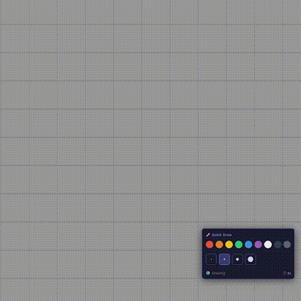

# 🖌️ Quick Draw for Foundry VTT

**Quick Draw** is a lightweight module for drawing temporary annotations on the canvas. Perfect for GMs and players who need to quickly point out directions or areas without cluttering the map with permanent drawings.

**Quick Draw** — это легкий модуль для быстрого рисования временных аннотаций на холсте. Идеально подходит для мастеров и игроков, которым нужно быстро показать направление или область, не оставляя при этом перманентных рисунков на карте.

> 

---

## 🇺🇸 English

### Features
* **Temporary Lines:** Drawings fade away automatically after a configurable delay.
* **Real-time Sync:** All players see your annotations instantly.
* **Floating Toolbar:** A compact, draggable UI to pick colors and line thickness.
* **Compatibility:** Designed for Foundry v12, with basic support for newer versions.
* **Multi-language:** Supports English, Ukrainian, and Russian.

### Installation
Copy this manifest link into your Foundry VTT Module Manager:
`https://github.com/petkerk/quick-draw/releases/latest/download/module.json`

---

## 🇷🇺 Русский

### Особенности
* **Временные линии:** Рисунки исчезают сами через заданное время.
* **Синхронизация:** Все игроки видят ваши пометки мгновенно.
* **Удобная панель:** Перетаскиваемый тулбар для выбора цвета и толщины кисти.
* **Совместимость:** Разработано для Foundry v12, с поддержкой последующих версий.
* **Локализация:** Поддержка английского, украинского и русского языков.

### Установка
Скопируйте ссылку на манифест в менеджер модулей Foundry:
`https://github.com/petkerk/quick-draw/releases/latest/download/module.json`

---

## ⌨️ Controls / Управление

1. **Activate Toolbar / Тулбар:** Hold or Toggle **Q** (default).
2. **Draw / Рисование:** Hold **Alt** (default) and move your mouse.
3. **Customize:** Everything can be changed in `Module Settings`.

---

## 📜 License / Лицензия

This module is licensed under the **MIT License**.
Этот модуль распространяется под лицензией **MIT**.

---

## ☕ Support the Project / Поддержать проект

If you find this module useful and want to support its development, you can buy me a coffee or send some crypto. Any support is greatly appreciated! ❤️

Если вам полезен этот модуль и вы хотите поддержать его развитие, можете «задонатить на кофе» или закинуть крипты. Буду очень благодарен! ❤️

### Crypto Addresses:

* **BTC:** `bc1qs083tkvcc9de7wnwe6a8wywvyzcg803ys4q8f6`
* **ETH / USDT (ERC20/BEP20):** `0xFFc2c757591D2A77D990E2E405d50DA6B105459C`
* **TON:** `UQBYiWU-HIx7tg1uN85E6Oa2ek5BBR0JDgINs3yOPMojdRYD`
* **SOL:** `DbpvYT65FP5ZXVGvkiKQh9Wk7aE4rNwMY9ENjPdGxAvj`
* **USDT TRC20:** `TRiar6KuEtWFrqVCYqhN1ezLRwp7qZLv2P`
* **LTC:** `ltc1qywfuty0z32wl35ndhl2kjawe98zdqce2wylacd`

---
